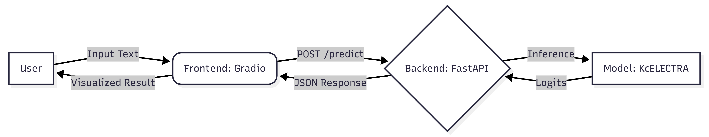
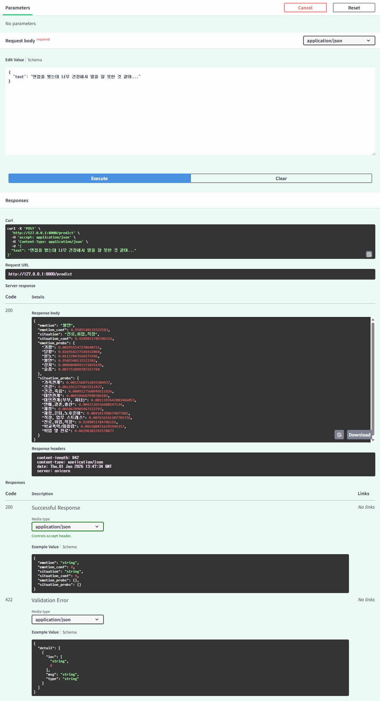

# 🎋 Mind Log: Multi-Task Emotion Tracker

**"당신의 감정을 비워드리는 AI 가비지 컬렉터 (Emotional Garbage Collector)"**

_말하지 않아도 드러나는 감정의 흐름을 데이터로 기록하다_

[18.12.2025 01_39.webm](https://github.com/user-attachments/assets/94ff4254-39b0-4948-a584-2410b377fff2)

<br>

## 1. 프로젝트 개요

**Mind Log** 는 사용자의 구어체 텍스트를 분석하여 **'감정(Emotion)'** 과 **'상황(Situation)'** 을 동시에 추론하는 **Multi-Task Learning (MTL) 기반의 AI 분석 시스템**입니다.

현대인들은 부정적인 감정을 털어놓고 싶어 하지만, 지인에게 말하기엔 부담스럽고 SNS에는 기록이 남을까 우려합니다. Mind Log는 **"침묵의 기록(Silent Tracker)"** 을 지향합니다. 사용자가 뱉어낸 감정적 언어를 AI가 객관적으로 분석하고 분류해 줌으로써, **"내 말이 이해받았다"는 심리적 위로를 제공하고 감정의 객관화를 돕습니다.**

### 핵심 목표

- **효율적인 모델 서빙**: 무거운 LLM 대신 경량화된 모델(KcELECTRA)을 사용하여 CPU 환경에서도 **50ms 이내** 의 추론 속도 달성.
- **확장 가능한 백엔드**: FastAPI를 도입하여 모델 서빙 로직을 API로 분리, 확장 가능한 아키텍처 구현.
- **데이터 강건성 확보**: 문어체가 아닌 뉴스 댓글 데이터 기반 모델을 사용하여 **구어체, 신조어, 오탈자** 에 강건한 성능 확보.

<br>

## 2. 시스템 아키텍처

단일 모델이 두 가지 태스크를 동시에 처리하는 **Multi-Task Learning (MTL)** 구조 위에, **FastAPI** 를 활용한 서빙 레이어를 구축했습니다.



### 2-1. 모델링 (Multi-Task Learning)

- **공유 인코더 (Hard Parameter Sharing)**: `KcELECTRA-Base`를 공유하여 문맥 정보를 학습.
- **독립적인 분류 헤드**: 감정(Emotion)과 상황(Situation)을 위한 별도의 분류기(Classifier) 부착.
- **최적화 전략**: `Weighted CrossEntropy Loss`를 적용하여 데이터 불균형(Imbalance) 해소.

### 2-2. 서빙 아키텍처 (Serving)

- **백엔드 (FastAPI)**: Pydantic을 활용한 입출력 검증 및 비동기 추론 처리. (Port: 8000)
- **프론트엔드 (Gradio)**: API 서버와 통신하여 실시간 분석 결과 및 타임라인 시각화 제공. (Port: 7860)

<br>

## 3. 성능 평가

초기 모델(KoBERT)의 한계를 분석하고, 도메인에 적합한 모델(KcELECTRA) 선정과 Loss 최적화를 통해 실사용 가능한 성능을 확보했습니다.

| Model                 | Task      | Accuracy  | Improvement    |
| :-------------------- | :-------- | :-------- | :------------- |
| **KoBERT (Baseline)** | Emotion   | 23.4%     | -              |
| **KcELECTRA (Final)** | Emotion   | **76.9%** | **+53.5%p** 🔺 |
|                       |           |           |                |
| **KoBERT (Baseline)** | Situation | 23.8%     | -              |
| **KcELECTRA (Final)** | Situation | **74.6%** | **+50.8%p** 🔺 |

> **Insight**: 뉴스 댓글 데이터로 학습된 `KcELECTRA`는 구어체 이해도가 매우 높아, 모델 교체만으로 비약적인 성능 향상을 이뤘습니다.

<br>

## 4. 프로젝트 구조

로직의 모듈화를 위해 **API(Backend)**와 **Demo(Frontend)** 코드를 분리하였습니다.

```bash
mindlog/
├── api/                   # Backend Logic (FastAPI)
│   ├── inference.py       # Model Inference Handler
│   ├── schemas.py         # Pydantic Data Models
│   └── config.py          # Path & Hyperparameter Config
├── data/                  # Data Assets
│   └── processed/         # Preprocessed Data & Label Maps
├── models/                # Trained Model Binary (.bin)
├── main.py                # FastAPI Server Entry Point
├── app_gradio.py          # Gradio Client UI
├── requirements.txt       # Dependencies
└── test_api.py            # API Testing Script
```

<br>

## 5. 시작하기

본 프로젝트는 **Server(FastAPI)** 와 **Client(Gradio)** 가 분리되어 있습니다. 두 개의 터미널에서 순서대로 실행해야 합니다.

### 5-1. 설치

```bash
git clone https://github.com/byahram/mindlog.git
cd mindlog
pip install -r requirements.txt
```

### 5-2. 서버 실행 (Backend)

먼저 모델을 로드하고 API 서버를 구동합니다.

```bash
# Terminal 1
uvicorn main:app --reload
```

- Server Status: `http://127.0.0.1:8000`
- API Docs: `http://127.0.0.1:8000/docs` (Swagger UI에서 API 테스트 가능)

<details>
<summary><strong>📸 API 테스트 결과 스크린샷</strong></summary>
<br>

<p align="center"> 

<br>
<em>API 테스트 결과 (Swagger UI): 모델이 정상적으로 감정과 상황을 분류하여 JSON으로 응답합니다.</em> 
</p>

</details>

### 5-3. 클라이언트 실행 (Frontend)

서버가 켜진 상태에서, 새로운 터미널을 열어 UI를 실행합니다.

```bash
# Terminal 2
python app_gradio_api.py
```

- Client Access: `http://127.0.0.1:7860` 브라우저 접속

<br />

## 6. Tech Stack

| Category | Technology                           |
| -------- | ------------------------------------ |
| Language | Python 3.9+                          |
| Model    | beomi/KcELECTRA-base-v2022 (PyTorch) |
| Backend  | FastAPI, Uvicorn, Pydantic           |
| Frontend | Gradio, Matplotlib                   |
| Data     | Pandas, AI Hub (감성 대화 말뭉치)    |
